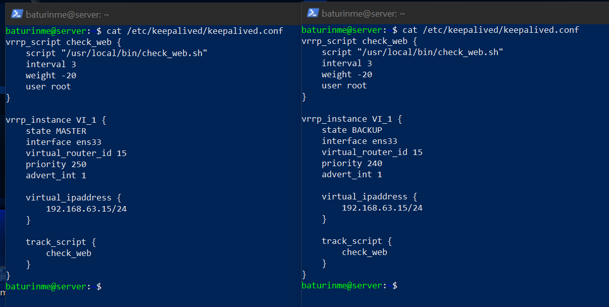

# Домашнее задание к занятию 1 «Disaster recovery и Keepalived»

## Задание 1


## Задание 2

### Конфиги на двух машинах



### Скрипт проверки доступности веб-сервера

Файл: `/usr/local/bin/check_web.sh`

```bash
#!/bin/bash

PORT=80
FILE="/var/www/html/index.html"

if ! nc -z 127.0.0.1 $PORT; then
    exit 1
fi

if [ ! -f "$FILE" ]; then
    exit 1
fi

exit 0
```


Скриншот с демонстрацией переезда:
