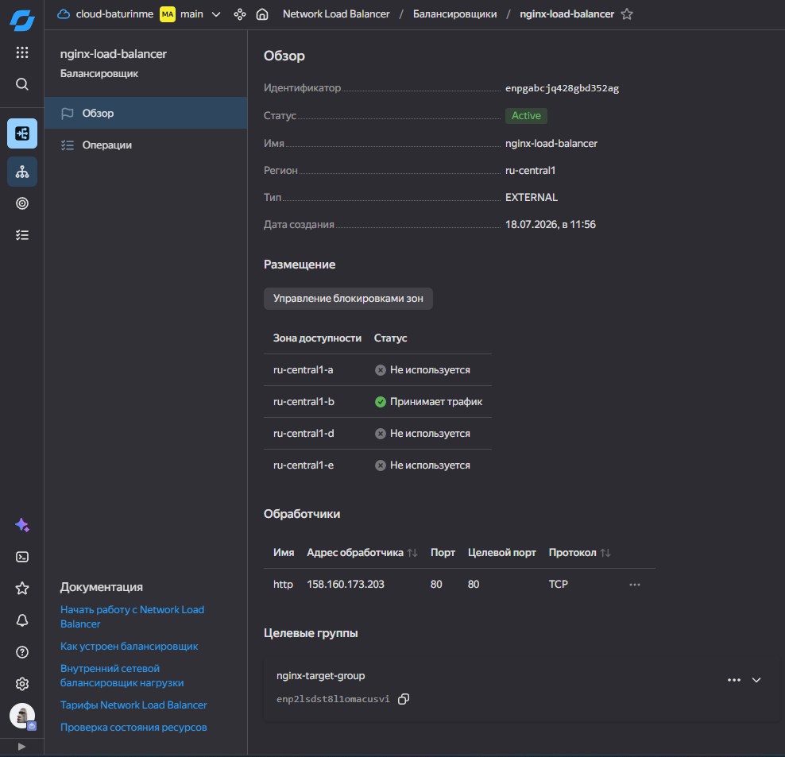
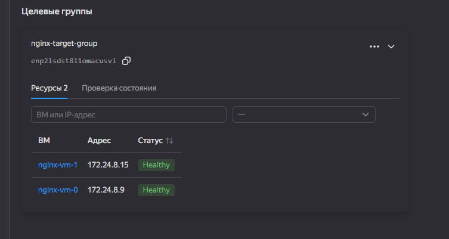
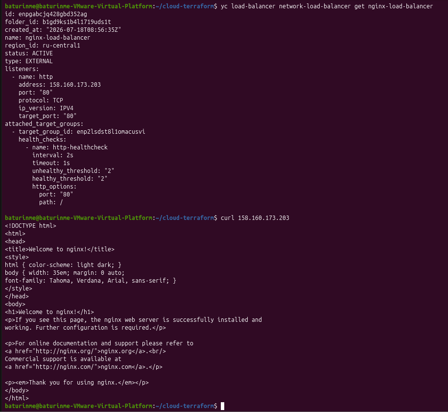

# Домашнее задание к занятию «Отказоустойчивость в облаке»

### Terraform Playbook

```
terraform {
  required_providers {
    yandex = {
      source = "yandex-cloud/yandex"
    }
  }
}

provider "yandex" {
  zone                    = "ru-central1-b"
  folder_id               = "b1gd9ks1b4l1719uds1t"
  service_account_key_file = "key.json"
}

resource "yandex_vpc_network" "network1" {
  name = "network1"
}

resource "yandex_vpc_subnet" "subnet1" {
  name           = "subnet1"
  zone           = "ru-central1-b"
  network_id     = yandex_vpc_network.network1.id
  v4_cidr_blocks = ["172.24.8.0/24"]
}

resource "yandex_compute_instance" "vm" {
  count = 2
  name = "nginx-vm-${count.index}"
  platform_id = "standard-v1"
  resources {
    cores  = 2
    memory = 2
  }
  boot_disk {
    initialize_params {
      image_id = "fd83ica41cade1mj35sr"
    }
  }
  network_interface {
    subnet_id = yandex_vpc_subnet.subnet1.id
    nat       = true
  }
  metadata = {
    ssh-keys = "ubuntu:${file("~/.ssh/id_ed25519.pub")}"
    user-data = <<-EOF
      #cloud-config
      packages:
        - nginx
      runcmd:
        - systemctl enable nginx
        - systemctl start nginx
    EOF
  }
}

resource "yandex_lb_target_group" "group1" {
  name = "nginx-target-group"
  dynamic "target" {
    for_each = yandex_compute_instance.vm
    content {
      subnet_id = yandex_vpc_subnet.subnet1.id
      address = target.value.network_interface[0].ip_address
    }
  }
}

resource "yandex_lb_network_load_balancer" "balancer1" {
  name = "nginx-load-balancer"
  listener {
    name = "http"
    port = 80
    external_address_spec {
      ip_version = "ipv4"
    }
  }
  attached_target_group {
    target_group_id = yandex_lb_target_group.group1.id
    healthcheck {
      name = "http-healthcheck"
      http_options {
        port = 80
        path = "/"
      }
    }
  }
}
```

### Скриншот статуса балансировщика



### Скриншот статуса целевой группы



### Скриншот страницы, которая открылась при запросе IP-адреса балансировщика.



