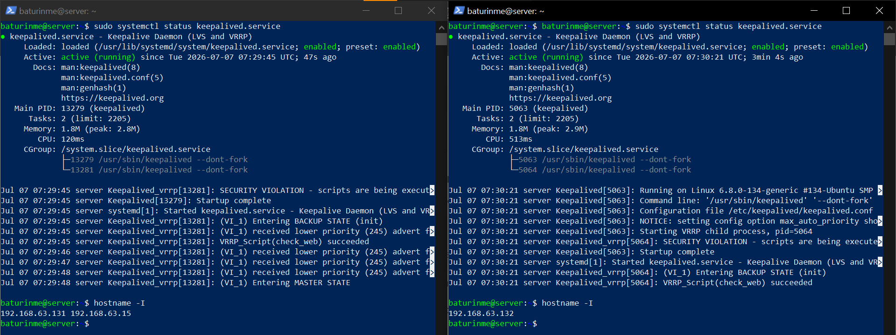
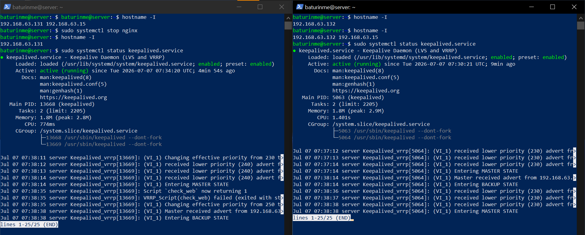

# Домашнее задание к занятию 1 «Disaster recovery и Keepalived»

## Задание 1

### Скриншот 1


### Скриншот 2


### Скриншот 3


## Задание 2

### Конфиги Keepalived на двух виртуальных машинах


### Скрипт проверки доступности веб-сервера

```bash
#!/bin/bash

PORT=80
FILE="/var/www/html/index.html"

if ! nc -z 127.0.0.1 $PORT; then
    exit 1
fi

if [ ! -f "$FILE" ]; then
    exit 1
fi

exit 0
```


### Скриншот до "переезда" плавающего ip



### Скриншот самого "переезда" плавающего ip

